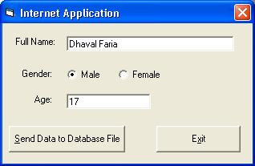



## Easy way to store data to Access Web Database File

### Description

I was in need of certain application that can store data in to the database and the database is stored on the Web.. And I want it without XML. I asked many people that how Audiogalaxy and Napster are doing those all the things.. they told they are using such service like XML or other.. But I don't want to use XML. So I develope application for me.. It is really very easy to use and also very easy to develope.. This is made with Visual Basic and simple codes of ASP. Must See this code.. and please vote for it..

NOTE: Now probleme is that, that I am not able to get data from the web. If any one can do it.. please let me know..
 
### More Info
 
No Side effects...

             |
---                |---
**Submitted On**   |2002-04-23 23:16:04
**By**             |[Dhaval Faria](https://github.com/Planet-Source-Code/PSCIndex/blob/master/ByAuthor/dhaval-faria.md)
**Level**          |Beginner
**User Rating**    |4.0 (16 globes from 4 users)
**Compatibility**  |VB 5\.0, VB 6\.0
**Category**       |[Databases/ Data Access/ DAO/ ADO](https://github.com/Planet-Source-Code/PSCIndex/blob/master/ByCategory/databases-data-access-dao-ado__1-6.md)
**World**          |[Visual Basic](https://github.com/Planet-Source-Code/PSCIndex/blob/master/ByWorld/visual-basic.md)
**Archive File**   |[Easy\_way\_t749344232002\.zip](https://github.com/Planet-Source-Code/dhaval-faria-easy-way-to-store-data-to-access-web-database-file__1-34071/archive/master.zip)

